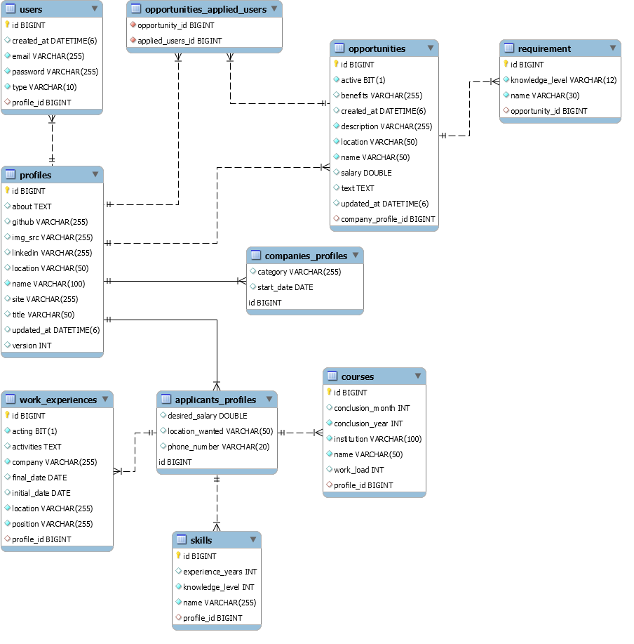

- [DER](#der)
- [Tabelas/Entidades](#tabelasentidades)
  - [Users (Usuários)](#users-usuários)
  - [Profiles (Perfis)](#profiles-perfis)
  - [Applicants Profiles (Perfis de candidatas)](#applicants-profiles-perfis-de-candidatas)
  - [Companies Profiles (Perfis de empresas)](#companies-profiles-perfis-de-empresas)
  - [Skills (Habilidades)](#skills-habilidades)
  - [Courses (Cursos)](#courses-cursos)
  - [Work Experiences (Experiências)](#work-experiences-experiências)
  - [Opportunities (Oportunidades)](#opportunities-oportunidades)
  - [Requirements (Requisitos)](#requirements-requisitos)

Para o banco de dados da aplicação foi utilizado o banco de dados relacional MySQL, sendo este um dos requisitos colocados para a elaboração do projeto.

# DER

# Tabelas/Entidades

As tabelas e entidades foram modeladas e ajustadas de acordo com as necessidades da aplicação conforme ela ia sendo desenvolvida, seguindo a filosofia de projetos ágeis. Por exemplo, no início do projeto, havíamos iniciado o banco de dados somente com uma entidade: a de usuário. Ao longo do desenvolvimento do projeto e de novas features, o restante das entidades foram sendo incluídas e integradas junto às outras, como a entidade para uma oportunidade, por exemplo.

A seguir estão listadas as entidades e uma breve descrição de cada campo.

## Users (Usuários)

A entidade `User` representa a informação básica necessária para a identificação do usuário, como email e tipo, e para armazenar as suas credenciais de acesso. Para a senha, é armazenado somente o hash da senha para comparação, sendo este gerado utilizando o encoder bcrypt.

Campos:

- `email`: email do usuário utilizado ao se registrar;
- `password`: hash da senha do usuário;
- `type`: tipo da conta: candidata (`APPLICANT`) ou empresa (`COMPANY`).

## Profiles (Perfis)

Os perfis para candidatas e empresas foram modelados de forma a se utilizar a herança entre objetos. Na modelagem das entidades, foram criadas 3 classes para os perfis: `Profile`, `ApplicantProfile` e `CompanyProfile`. A classe `Profile` é uma classe abstrata que contém os campos compartilhados entre as duas entidades para evitar a repetição de código. No nível do banco de dados, foi utilizado a estratégia de herança `JOINED` do Hibernate, no qual são criadas uma tabela para cada classe, contendo somente os campos específico de cada classe.

Campos: 

- `name`: nome da candidata ou empresa;
- `about`: campo de texto para a seção "Sobre";
- `title`: título da candidata ou empresa;
- `img_src`: URL para a imagem de perfil;
- `location`: localização da candidata ou empresa (ex: São Paulo, SP);
- `linkedin`: link para o perfil do LinkedIn;
- `github`: link para o perfil do Github;
- `site`: link para o site próprio;

## Applicants Profiles (Perfis de candidatas)

Além dos campos herdados da superclasse [`Profile`](#profiles-perfis), o perfil de candidata possui os seguinte campos adicionais:

- `locationWanted`: localização que a candidata deseja trabalhar;
- `desired_salary`: salário desejado;
- `phone_number`: número de celular para contato via WhatsApp;
- `skills`: lista de [habilidades](#skills-habilidades) da candidata;
- `courses`: lista de [cursos e certificações](#courses-cursos) da candidata;
- `work_experiences`: lista de [experiências](#work-experiences-experiências) da candidata.

## Companies Profiles (Perfis de empresas)

Além dos campos herdados da superclasse [`Profile`](#profiles-perfis), o perfil de empresa possui os seguinte campos adicionais:

- `start_date`: data de fundação da empresa;
- `category`: ramo de trabalho/serviço da empresa.

## Skills (Habilidades)

- `name`: nome da habilidade;
- `experience_years`: anos de experiência com a habilidade;
- `knowlegde_level`: nível de conhecimento da habilidade: básico (`BASIC`), intermediário (`INTERMEDIATE`) ou avançado (`ADVANCED`);

## Courses (Cursos)

- `name`: nome do curso ou certificação;
- `institution`: instituição emissora;
- `work_load`: carga horária (em horas);
- `conclusion_month`: mês de conclusão;
- `conclusion_year`: ano de conclusão.

## Work Experiences (Experiências)

- `company`: nome da empresa;
- `position`: cargo;
- `location`: localização;
- `activities`: resumo das atividades realizadas;
- `initial_date`: data de início no cargo;
- `final_date`: data final no cargo;
- `acting`: `true` se for o cargo atual, `false` caso contrário.

## Opportunities (Oportunidades)

- `name`: nome da oportunidade;
- `location`: localização que a oportunidade está sendo ofertada;
- `description`: descrição curta da oportunidade;
- `benefits`: benefícios da oportunidade;
- `salary`: salário da oportunidade;
- `text`: campo para texto livre descrevendo a oportunidade com mais detalhes;
- `active`: boolean representando se a oportunidade está ativa ou não;
- `requirements`: habilidades [requisitadas](#requirements-requisitos) para a oportunidade.

## Requirements (Requisitos)

- `name`: nome da habilidade requisitada;
- `knowlegde_level`: nível de conhecimento da habilidade: básico (`BASIC`), intermediário (`INTERMEDIATE`) ou avançado (`ADVANCED`).